<div align="center">



[`GitHub`](https://github.com/HillaryIkhais) · [`Featured Work`](#featured-work) · [`How I Think`](#how-i-think-about-building)

</div>

---

> I care about what happens underneath the API call. The retrieval pipeline that decides what the model sees. The evaluation framework that proves whether it actually works. The engineering that makes inference run on hardware that doesn't have a GPU. The agent architecture that doesn't fall apart when two agents disagree about the state of the world.

Most of my work lives at the intersection of **ML systems engineering** and **applied AI** — building things that need to work under real constraints, not just in a demo.

---

## Featured Work

<table>
<tr>
<td width="50%" valign="top">

### <a href="https://github.com/HillaryIkhais/Sylon"><strong>SYLON</strong></a>

<p>


</p>

**Agentic behavioral intelligence platform.**

Sylon reads raw customer feedback and builds psychological timelines — tracking how taste evolves, where expectations shift, and what actually drives churn. It treats customers as evolving psychological entities, not static segments.

<details>
<summary><strong>What I built</strong></summary>

- Temporal phase analysis engine that splits user histories into behavioral phases and extracts drift signals
- Cross-domain translation engine that cold-starts recommendations by mapping psychological drivers across unrelated domains
- Multi-agent orchestration with intent routing, parallel extraction swarms, and a conversational strategist
- Zero-shot ranking evaluated against hold-out data

</details>

<details>
<summary><strong>Evaluation metrics</strong></summary>

| Metric | Score |
|:---|:---|
| RMSE (rating prediction) | **0.7906** |
| NDCG@10 (ranking) | **0.1605** |
| HitRate@10 | **0.2000** |
| ROUGE-L (generation fidelity) | **0.1311** |

Ablation without temporal phase splitting: RMSE degrades to 1.4491, NDCG@10 drops to 0.0652. Static summaries aren't enough.

</details>

<p><code>Python</code> <code>FastAPI</code> <code>Next.js</code> <code>SQLite</code> <code>ElevenLabs</code></p>

<p><a href="https://sylon.vercel.app/"><strong>Live Demo</strong> &rarr;</a></p>

</td>
<td width="50%" valign="top">

### <a href="https://github.com/HillaryIkhais/MOVA"><strong>MOVA</strong></a>

<p>


</p>

**Offline financial intelligence for African SMEs.**

MOVA converts messy WhatsApp messages, OPay SMS, and Pidgin voice-note transcripts into structured financial records — completely offline on an 8GB laptop. No cloud. No API fees. No internet required after model download.

<details>
<summary><strong>The hard problem</strong></summary>

Correctly understanding who owes whom in informal African commerce.

> "Chinedu still dey owe me 85k" is a receivable.
> "I wan pay Alhaji Bello 250k" is a payable.

Mixed Pidgin/English. Implicit context. Multiple transactions per message.

</details>

<details>
<summary><strong>Benchmark (130-example Nigerian economic test set)</strong></summary>

| Metric | Score |
|:---|:---|
| Entity extraction | **98%** |
| Debt direction | **92%** (improved from 35% via prompt engineering) |
| Status detection | **91%** |
| Amount extraction | **88%** |
| Full record accuracy | **78%** |

| On-device | Value |
|:---|:---|
| Model | Llama 3.2 3B (Q4_K_M) |
| Throughput | 7.32 tok/s on Apple M3 |
| Peak RAM | 4 GB |
| Disk | 2.02 GB |

</details>

<p><code>Llama</code> <code>llama.cpp</code> <code>Tauri</code> <code>Rust</code> <code>TypeScript</code></p>

</td>
</tr>
</table>

<br>

<table>
<tr>
<td width="50%" valign="top">

### <a href="https://github.com/HillaryIkhais/PulseRelay"><strong>PulseRelay</strong></a>

<p>


</p>

**Hands-free AI agent for paramedic patient transport.**

Paramedics talk. PulseRelay listens, remembers, and hands it off. It extracts structured clinical data from natural speech in real time — vitals, medications, patient demographics — tracks trends, asks for clarification on incomplete data, and generates a complete handoff summary for the receiving hospital.

> **The critical design choice:** Gemini handles understanding language. Deterministic Python code handles everything else — storing values, validating ranges, calculating trends, tracking confidence. No hallucinated vitals. No invented medications. The AI understands; the code decides.

<p><code>Gemini</code> <code>Google ADK</code> <code>FastAPI</code> <code>Cloud Run</code> <code>Firestore</code></p>

</td>
<td width="50%" valign="top">

### <a href="https://github.com/HillaryIkhais/RECKON"><strong>RECKON</strong></a>

<p>


</p>

**Control layer for autonomous AI agents.**

No consequential action should execute simply because the agent is confident. RECKON enforces that principle through an 11-phase state machine with recovery contracts, red-team subagents, and human approval gates.

```
INTAKE → INVESTIGATION → ANALYSIS → ACTION_PLAN → RECOVERY_CONTRACT
→ SANDBOX_VALIDATION → RED_TEAM → DECISION → HUMAN_CHECKPOINT
→ EXECUTION → VERIFICATION
```

| Action Type | RECKON Behavior |
|:---|:---|
| Read-only | Execute autonomously |
| Reversible | Requires human approval |
| Destructive | Blocked entirely |
| Unknown | Blocked entirely |

<p><code>TypeScript</code> <code>TrueForge</code> <code>MCP</code> <code>Ollama</code> <code>Node.js</code></p>

</td>
</tr>
</table>

<br>

<table>
<tr>
<td width="50%" valign="top">

### <a href="https://github.com/HillaryIkhais/Vanished"><strong>VANISHED</strong></a>

<p>


</p>

**Semantic data-integrity detection for self-healing scrapers.**

Self-healing scrapers fix broken extraction logic automatically. But how do you know the repaired scraper is still returning the right data? Vanished is the verification layer — it compares scraper output across snapshots and detects information loss, contract changes, contradictions, and pipeline drift.

> A scraper that runs isn't necessarily a scraper you can trust.

<p><code>Python</code> <code>pytest</code> <code>Bright Data</code> <code>Next.js</code> <code>React</code></p>

<p><a href="https://vanished-six.vercel.app/"><strong>Live Demo</strong> &rarr;</a></p>

</td>
<td width="50%" valign="top">

### <a href="https://github.com/HillaryIkhais/CREDO"><strong>CREDO</strong></a>

<p>


</p>

**Offline-first Edge AI for pharmaceutical verification.**

Counterfeit drugs kill over 100,000 people annually in sub-Saharan Africa. CREDO eliminates verification friction by running drug authentication entirely on-device — no internet, no cloud API, no latency.

> Built for the hardware that exists in the places where this problem is most acute.

<p><code>Python</code> <code>Edge AI</code> <code>Offline-first</code></p>

<p><a href="https://credo-lime.vercel.app/"><strong>Live Demo</strong> &rarr;</a></p>

</td>
</tr>
</table>

---

## How I Think About Building

> These aren't principles I wrote on a whiteboard. They're patterns I keep running into.

<table>
<tr>
<td width="50%">

#### Evaluation before demos

A system that runs isn't a system that works. I'd rather show you an RMSE score than a screenshot. Every project above has real numbers attached — and where the numbers are weak, I say so.

</td>
<td width="50%">

#### Abstractions earn their place

I use frameworks when they solve the problem. I drop down to llama.cpp when they don't. MOVA runs on-device because the constraint demanded it, not because offline-first sounds good on a landing page.

</td>
</tr>
<tr>
<td width="50%">

#### Complexity should be provable

Vanished's semantic comparison engine, Sylon's ablation studies, MOVA's benchmark suite — I keep building verification into the system, not after it.

</td>
<td width="50%">

#### The interesting work is in the plumbing

Retrieval quality, ranking signals, data pipelines, inference optimization, agent coordination — the model is the easy part. Everything around it is the actual engineering problem.

</td>
</tr>
</table>

---

## Currently Exploring

<table>
<tr>
<td width="33%" valign="top">

**Actively Building**

Retrieval and ranking systems with real evaluation

Agent coordination that survives multi-turn state

Local inference optimization for constrained hardware

</td>
<td width="33%" valign="top">

**Learning**

Knowledge graph memory for agent coherence

Structured evaluation for generative systems

Robotics and embodied AI

</td>
<td width="33%" valign="top">

**Interested In**

When agents reason about their own reliability

ML systems that degrade gracefully

Retrieval augmentation meets agent memory

</td>
</tr>
</table>

---

## Tech I Work With

<table>
<tr>
<td align="center"></td>
<td align="center"></td>
<td align="center"></td>
<td align="center"></td>
</tr>
<tr>
<td align="center"></td>
<td align="center"></td>
<td align="center"></td>
<td align="center"></td>
</tr>
<tr>
<td align="center"></td>
<td align="center"></td>
<td align="center"></td>
<td align="center"></td>
</tr>
</table>

---

<div align="center">

*Currently building. Open to interesting problems.*

[](https://github.com/HillaryIkhais)

</div>
